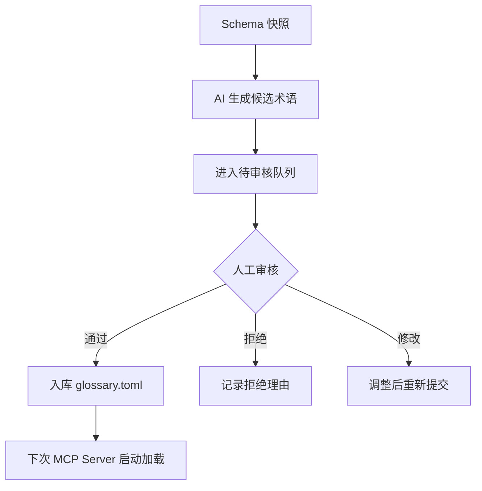

# MCP 数据库助手 - 管理员手册

| 项 | 内容 |
|---|---|
| 文档版本 | v0.3 |
| 日期 | 2026-08-05 |
| 状态 | 与 mcp_db.md v0.3 配套 |

---

## 1. 概述

本手册面向运维管理员，涵盖 MCP Server 的**离线管理操作**：

- 连接管理（添加、测试、移除）
- 语义词典维护（AI 辅助 + 人工审核）
- 团队部署配置
- 审计日志查看
- 监控指标

> **注意**：以下内容是管理员操作，**不是** AI 客户端的 MCP 协议调用。

---

## 2. 连接管理

### 2.1 CLI 命令

```bash
# 添加连接
db-assistant add postgres --name main-prod --host db.internal --port 5432 --dbname orders --user svc_ai --read-only
db-assistant add mysql --name local-dev --host 127.0.0.1 --port 3306 --dbname app --user root

# 列出所有连接
db-assistant list

# 测试连接连通性
db-assistant test main-prod

# 查看审计日志（--slow 仅显示慢查询，--threshold 自定义阈值 ms，可与 --user/--connection/--tool 组合）
db-assistant logs --tail 50
db-assistant logs --slow --threshold 1000 --user alice

# 移除连接
db-assistant remove main-prod

# 刷新 schema 缓存
db-assistant refresh main-prod

# 校验配置合法性（文件/权限/TOML/schema/连接/HTTP，存在 error 时退出码非 0）
db-assistant config validate --config /path/to/config.toml

# 全面体检：配置 + 依赖版本 + glossary + 各连接连通性 + metrics 端口占用
db-assistant doctor --config /path/to/config.toml
```

### 2.2 配置文件

配置文件位于 `~/.config/db-assistant/config.toml`（本地部署）或团队共享路径。

```toml
[server]
mode = "read_only"          # read_only | safe_write | full
default_limit = 100
query_timeout_sec = 10
max_concurrent = 5
schema_cache_ttl_sec = 300
config_reload_interval_sec = 30   # 配置热重载轮询间隔（秒），0 = 关闭热重载

[connections.postgres-prod]
type = "postgres"
host = "db.internal"
port = 5432
database = "orders"
user = "svc_ai"
password_env = "DB_ASSISTANT_PG_PROD_PASSWORD"
masked_columns = ["phone", "email", "id_card"]
exclude_columns = ["users.salary", "orders.card_number"]
exclude_tables = ["audit_log", "raw_events"]

[connections.mysql-local]
type = "mysql"
host = "127.0.0.1"
port = 3306
database = "app"
user = "root"
password_env = "DB_ASSISTANT_MYSQL_LOCAL_PASSWORD"
mode = "full"               # 仅本地开发库

[semantic]
glossary_file = "glossary.toml"
templates_dir = "templates/"

[audit]
output = "file"             # file | stdout | stderr | webhook（stdio 下 stdout 自动降级 stderr）
path = "~/.config/db-assistant/audit.log"

[metrics]
enabled = true
port = 9102                 # Prometheus 端点
```

### 2.3 凭据管理

密码通过环境变量引用，不存储明文：

```bash
export DB_ASSISTANT_PG_PROD_PASSWORD="your-password"
```

### 2.4 配置热重载（v0.2）

服务运行期间会按 `[server].config_reload_interval_sec`（默认 30 秒，0 关闭）轮询配置文件，
检测到变更后自动生效，无需重启：

- **连接增删改**：新增连接立即可用；删除的连接池被关闭；连接参数（host/port/账号等）变更后
  旧池被重建，进行中的查询不受影响
- **`[server]` 全局参数**：`default_limit` / `query_timeout_sec` / `max_concurrent` 等变更后
  所有连接运行时重建
- **`[audit]` 与 glossary 文件**：变更后审计器/语义词表重新加载，运行时同步重建
- **环境变量凭据**：重载时会重新读取 `password_env` 引用的环境变量

注意事项：
- 配置文件写坏（TOML 语法错误、必填字段缺失）时**保留旧配置继续服务**，并每周期记录告警，
  修复后自动生效（不会中断正在运行的查询）
- `[http]`（端口/token）与 `[metrics]` 变更**不热生效**，需重启进程
- stdio 与 streamable-http 两种模式均支持热重载

---

## 3. 团队部署

### 3.1 部署模式

| 模式 | 适用场景 | 配置位置 |
|---|---|---|
| **本地独立部署** | 个人开发者自用 | `~/.config/db-assistant/config.toml` |
| **共享服务部署** | 团队共享单一 MCP Server 实例 | 团队共享路径（如 `/opt/db-assistant/config.toml`） |

### 3.2 配置文件共享机制

共享部署时，采用**集中管理 + 本地覆盖**策略：

```toml
# 共享基础配置（团队管理员维护）
[connections.prod]
type = "postgres"
host = "db.internal"
# ... 连接参数 ...

# 本地覆盖配置（开发者自行维护）
[connections.prod.override]
# 可在本地指定不同环境变量
password_env = "MY_LOCAL_DB_PASSWORD"
```

### 3.3 用户身份追溯

审计日志中的 `user` 字段来源：

1. **MCP 客户端传递**：如 `cursor@alice`、`claude-code@bob`
2. **环境变量降级**：`DB_ASSISTANT_USER`（由客户端启动脚本注入）
3. **系统用户兜底**：`whoami`（仅限本地部署）

### 3.4 连接级访问控制（v2）

| 角色 | 权限 |
|---|---|
| `viewer` | 只读查询，无敏感表访问权限 |
| `analyst` | 只读查询 + 执行计划 + 语义层 |
| `admin` | 全部连接可访问 + 连接管理 CLI |

MVP 不做 RBAC，通过 `exclude_tables` 和 `exclude_columns` 实现表级隔离。

### 3.5 SSH 隧道（v2）

支持通过 SSH 隧道连接内网数据库：

```toml
[connections.prod-via-ssh]
type = "postgres"
host = "localhost"
port = 5432
database = "orders"
user = "svc_ai"
password_env = "DB_ASSISTANT_PG_PROD_PASSWORD"

ssh_host = "bastion.company.com"
ssh_user = "deploy"
ssh_key_env = "DB_ASSISTANT_SSH_KEY"
# ssh_passphrase_env = "DB_ASSISTANT_SSH_PASSPHRASE"  # 可选
```

### 3.6 远程共享部署（streamable HTTP，v0.2）

除 stdio（本地进程内）外，Server 支持 streamable HTTP 传输，供团队/服务器共享单一实例。

#### 3.6.1 部署选型对照

| 维度 | stdio | streamable HTTP |
|---|---|---|
| 适用场景 | 个人本地使用 | 团队共享 / 远程服务器部署 |
| 传输 | 子进程 stdin/stdout | HTTP/SSE（/mcp 端点） |
| 鉴权 | 无（进程本地） | **强制** Bearer token（fail-closed） |
| 监听地址 | 无 | `[http].host`（默认 127.0.0.1） |
| 健康检查 | 无 | `GET /healthz`（需 token） |
| 指标 | `http://127.0.0.1:9102/metrics` | 同左 + `GET /metrics`（需 token） |

#### 3.6.2 配置与启动

```toml
[http]
token_env = "DB_ASSISTANT_HTTP_TOKEN"   # 必填：token 只经环境变量注入，不落盘
host = "0.0.0.0"                         # 远程共享需监听对外地址
port = 8000
```

```bash
export DB_ASSISTANT_HTTP_TOKEN="$(openssl rand -hex 32)"   # 生成强随机 token
python -m db_assistant_mcp --transport streamable-http --host 0.0.0.0 --port 8000
```

- **未配置 `token_env` 或环境变量为空时，HTTP 模式拒绝启动**（fail-closed），stdio 模式不受影响。
- 客户端连接地址：`http://<服务器>:8000/mcp`，请求头携带 `Authorization: Bearer <token>`。
- token 采用恒定时间比较，不进入配置对象、不写入审计日志。

#### 3.6.3 TLS 反向代理（推荐）

远程部署必须走 TLS，避免 token 明文传输。以下为 nginx 与 Caddy 示例：

```nginx
# /etc/nginx/conf.d/db-assistant.conf
server {
    listen 443 ssl;
    server_name mcp.example.com;
    ssl_certificate     /etc/nginx/ssl/mcp.crt;
    ssl_certificate_key /etc/nginx/ssl/mcp.key;

    location /mcp {
        proxy_pass http://127.0.0.1:8000;
        proxy_http_version 1.1;
        proxy_set_header Host $host;
        proxy_set_header Upgrade $http_upgrade;
        proxy_set_header Connection "upgrade";
        proxy_read_timeout 300s;
    }
    # 健康检查（反向代理到内部时无需 token，或按需保留）
    location = /healthz { proxy_pass http://127.0.0.1:8000; }
}
```

```caddy
# Caddyfile（自动申请/续期 Let's Encrypt 证书）
mcp.example.com {
    reverse_proxy /mcp 127.0.0.1:8000
    reverse_proxy /healthz 127.0.0.1:8000
}
```

> 若反向代理层未鉴权，建议在 `location` 增加 IP 白名单：`allow 10.0.0.0/8; deny all;`，
> 并把 MCP 的 `host` 保持为 `127.0.0.1`（仅本机反代可达）。

#### 3.6.4 token 轮换

1. 生成新 token：`export DB_ASSISTANT_HTTP_TOKEN="$(openssl rand -hex 32)"`；
2. 重启服务使新 token 生效（`systemctl restart db-assistant-mcp` 或等价操作）；
3. 更新各 MCP 客户端的 `Authorization` 配置；
4. 建议定期轮换（如每 90 天）或凭据疑似泄露时立即轮换。

#### 3.6.5 升级 / 回滚

```bash
# 升级：备份配置 → 更新代码/依赖 → 校验配置 → 重启
cp config.toml config.toml.bak.$(date +%F)
cd /opt/db-assistant && .venv/bin/pip install -e . --upgrade
.venv/bin/python -m db_assistant_mcp --transport streamable-http --host 0.0.0.0 --port 8000 &

# 回滚：恢复备份配置 + 旧版本代码后重启，并验证 /healthz 返回 healthy
curl -H "Authorization: Bearer $DB_ASSISTANT_HTTP_TOKEN" http://127.0.0.1:8000/healthz
```

#### 3.6.6 监控

- 带 token 访问 `GET http://127.0.0.1:8000/healthz`：数据库全部可达返回 `200 healthy`，任一不可达返回 `503 unhealthy`（含逐连接明细）。
- Prometheus 抓取 `GET /metrics`（HTTP 模式 8000 端口需 token；本地 9102 端点无需 token）。

---

## 4. 语义词典维护

### 4.1 概述

语义词典将列名翻译为业务语言，帮助 AI 生成更准确的 SQL。

### 4.2 glossary.toml 格式

```toml
[[terms]]
column = "user_order_dt"
meaning = "下单时间（用户确认订单的时间）"

[[terms]]
# 精确表名+列名
table = "orders"
column = "order_status"
meaning = "订单状态：pending/paid/shipped/completed/cancelled"

[[terms]]
# 正则匹配（优先级最低）
pattern = ".*_status$"
meaning = "状态字段，取值见对应枚举表"

[[terms]]
# 表级术语：search_schema 按语义/别名命中表本身（不落到列）
table = "users"
meaning = "用户主表（账号、联系方式与账号状态）"
aliases = ["用户", "顾客", "会员", "客户"]

[[terms]]
# aliases：同义词，search_schema 支持双向子串命中（如搜「订单时间」）
column = "user_order_dt"
meaning = "下单时间（用户确认订单的时间）"
aliases = ["下单时间", "订单时间"]
```

### 4.3 匹配优先级

| 优先级 | 匹配类型 | 示例 |
|---|---|---|
| 1（最高） | 精确表名 + 列名 | `orders.user_order_dt` |
| 2 | 精确列名（跨表通用） | `created_at` |
| 3 | 正则 pattern | `.*_status$` |

### 4.4 AI 辅助生成（已实现，v0.2）

AI 辅助生成候选术语，减少人工编写工作量：

```bash
# 管理员触发 AI 分析 schema 并生成候选
db-assistant semantic generate --connection prod

# AI 分析后输出到 glossary.candidate.toml
# 格式与 glossary.toml 相同，带 status = "pending_review"
```

生成的候选示例：

```toml
[[terms]]
column = "usr_lgn_tm"
meaning = "??? (AI 推测：用户登录时间，需人工确认)"
status = "pending_review"
confidence = 0.75

[[terms]]
column = "ord_amt"
meaning = "??? (AI 推测：订单金额，需人工确认)"
status = "pending_review"
confidence = 0.92
```

### 4.5 人工审核

```bash
# 查看待审核列表
db-assistant semantic review --list

# 审核通过
db-assistant semantic review --approve --id 1 --meaning "用户登录时间"

# 审核拒绝
db-assistant semantic review --reject --id 1 --reason "该字段实际是最后活跃时间"

# 批量导入
db-assistant semantic import --file glossary.candidate.toml
```

### 4.6 工作流图



---

## 5. 审计日志

> **stdio 模式提示（C-3）**：MCP stdio 传输下 stdout 专用于 JSON-RPC 协议流，
> 配置 `output = "stdout"` 会被自动降级为 `stderr`（启动日志有告警），
> 避免审计输出污染协议导致客户端解析失败；HTTP 模式不受影响。


### 5.1 日志格式

每条工具调用记录：

```json
{
  "ts": "2026-08-05T10:00:00+08:00",
  "client": "cursor",
  "user": "alice",
  "tool": "execute_query",
  "connection": "main-prod",
  "sql": "SELECT * FROM orders WHERE ...",
  "rows": 42,
  "duration_ms": 320,
  "allowed": true
}
```

### 5.2 安全拒绝日志

拒绝操作的日志不暴露具体原因：

```json
{
  "ts": "2026-08-05T10:00:00+08:00",
  "client": "cursor",
  "user": "alice",
  "tool": "execute_query",
  "connection": "main-prod",
  "sql": "UPDATE orders SET ...",
  "rows": 0,
  "duration_ms": 5,
  "allowed": false,
  "reason": "操作不允许"
}
```

详细拒绝原因（仅管理员可见）：

```json
{
  "detail": "WRITE_OPERATION_BLOCKED",
  "rule": "read_only_mode",
  "connection": "main-prod"
}
```

### 5.3 查看日志

```bash
# 实时查看
db-assistant logs --follow

# 最近 100 条
db-assistant logs --tail 100

# 按用户筛选
db-assistant logs --user alice

# 按连接筛选
db-assistant logs --connection main-prod

# 导出到文件
db-assistant logs --export audit-2026-08.json
```

### 5.4 webhook 输出（已实现，v0.1）

```toml
[audit]
output = "webhook"
url = "https://your-siem.company.com/webhook"
secret_env = "DB_ASSISTANT_WEBHOOK_SECRET"
```

---

## 6. 监控指标

### 6.1 Prometheus 端点

启用后可通过 `http://localhost:9102/metrics` 抓取：

```toml
[metrics]
enabled = true
port = 9102
```

### 6.2 关键指标

| 指标名 | 类型 | 说明 |
|---|---|---|
| `db_assistant_tool_calls_total` | Counter | 工具调用总数（按工具名/连接/结果分标签） |
| `db_assistant_query_duration_seconds` | Histogram | 查询延迟分布 |
| `db_assistant_security_rejections_total` | Counter | 安全拒绝次数 |
| `db_assistant_schema_cache_hits_total` | Counter | Schema 缓存命中数 |
| `db_assistant_active_connections` | Gauge | 当前活跃数据库连接数 |

### 6.3 SLO 目标

| 指标 | 目标 |
|---|---|
| 查询响应时间 | P50 < 3s，P95 < 8s，P99 < 15s |
| 服务可用性 | ≥ 99.5%（按周计） |
| 工具调用成功率 | ≥ 99% |
| Schema 缓存命中率 | ≥ 70% |

---

## 7. 故障排查

### 7.1 连接失败

```bash
# 测试连通性
db-assistant test <connection-name>

# 检查环境变量
echo $DB_ASSISTANT_*_PASSWORD

# 查看详细错误
db-assistant logs --connection <name> --tail 20
```

### 7.2 AI 无法看到 schema

1. 确认连接已配置且测试通过
2. 检查 `exclude_tables` 是否误排除目标表
3. 重启 MCP Server 刷新缓存
4. 手动触发刷新：`db-assistant refresh <connection>`

### 7.3 查询超时

1. 检查 `query_timeout_sec` 配置
2. 建议 AI 在 WHERE 条件加索引列
3. 查看慢查询：`db-assistant logs --tool execute_query --slow

### 7.4 敏感数据泄露

1. 检查 `masked_columns` 和 `exclude_columns` 配置
2. 确认 AI 使用的是只读账号
3. 查看审计日志中的异常查询模式

---

## 8. 版本规划

| 版本 | 内容 |
|---|---|
| **v0.1 MVP（已交付）** | CLI 连接管理、TOML 配置、审计（file/stdout/webhook）、脱敏、行数/超时限制 |
| **v0.2（已交付）** | 语义工作流（generate/review/import）、`translate_sql`、执行计划可视化、streamable HTTP 远程部署（Bearer token）、`config validate`/`doctor`、`logs --slow`、相似表名建议 |
| **v1.0（规划中）** | `generate_test_data`、`diff_schema`、safe_write 分档、SSH 隧道 |
| **v2（评估后决定）** | RBAC、`run_safe_update` |

---

## 9. 相关文档

- [MCP 协议设计](./mcp_db.md) - MCP Server 的协议层设计
- [快速开始](./getting-started.md) - 安装与首次配置
- [安全白皮书](./security.md) - 详细安全设计
