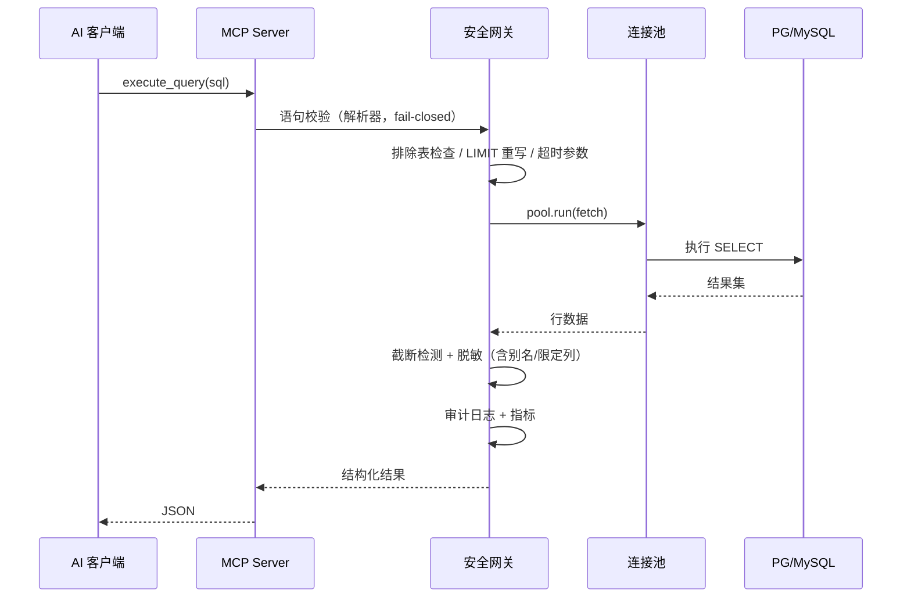

# 架构说明

## 模块划分

```text
src/db_assistant_mcp/
├── __main__.py          # python -m db_assistant_mcp（stdio 启动 / --version）
├── config.py            # config.toml 加载、${ENV} 替换、schema 校验、连接增删
├── errors.py            # 统一错误码与结构化异常
├── logging_utils.py     # JSON 结构化日志 + 敏感键脱敏
├── identity.py          # 调用身份解析（env → 系统用户）
├── secrets_util.py      # AES-256-GCM 凭据加密（主密钥 env / 本地密钥文件）
├── runtime.py           # 每连接运行时装配：pool + gateway + schema 缓存
├── semantic.py          # glossary.toml 语义层（精确表列 > 精确列 > 正则）
├── schema_service.py    # schema 快照缓存（TTL + 主动刷新 + 命中指标）
├── drivers/
│   ├── base.py          # DatabaseConnection 抽象 + 值规范化
│   ├── postgres.py      # asyncpg 连接、查询、introspection、EXPLAIN JSON
│   ├── mysql.py         # aiomysql 连接、查询、introspection、EXPLAIN
│   └── pool.py          # 独立连接池：隔离故障、空闲回收、自动重连、耗尽排队
├── security/
│   ├── sql_validator.py # sqlglot 分方言校验，fail-closed，LIMIT 重写，投影分析
│   ├── redactor.py      # masked/exclude 列与 exclude 表，别名/限定规则
│   ├── audit.py         # 审计日志 file / stdout / webhook
│   └── gateway.py       # 安全网关：校验→限制→执行→脱敏→审计
├── tools/               # list_databases/list_tables/get_table_schema/
│                        # search_schema/execute_query/explain_query/
│                        # refresh_schema/ping
├── resources/           # db://{name}/schema|tables|semantic
├── observability/
│   ├── metrics.py       # Prometheus 指标
│   └── http_server.py   # /metrics 与 /healthz（aiohttp）
├── server.py            # FastMCP 装配 + stdio + lifespan
└── cli/main.py          # db-assistant add/list/test/remove/logs/refresh
```

## 请求流程



## 设计要点

- **每连接独立运行时**：连接池、校验器、脱敏器、schema 缓存均按连接隔离，单连接故障不影响其他连接。
- **安全网关是唯一 DB 出口**：工具层只调用 gateway / schema 服务，不直接接触驱动。
- **缓存**：schema 快照按 `schema_cache_ttl_sec` 失效，`refresh_schema` 主动重建，命中计入 Prometheus。

