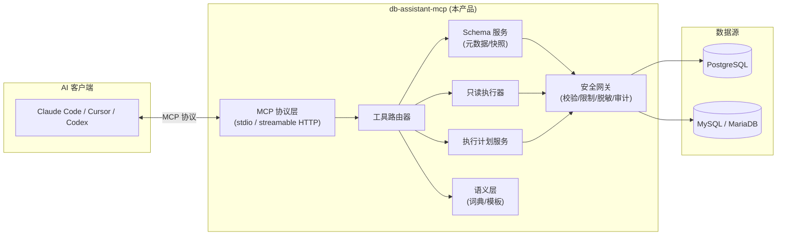
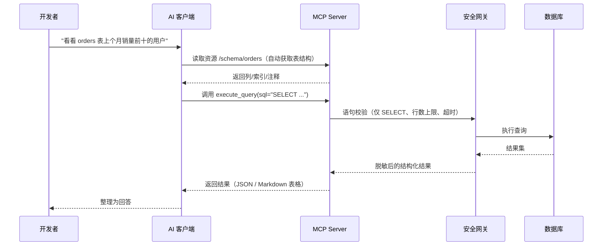

# MCP 数据库助手设计文档（PostgreSQL / MySQL）

| 项 | 内容 |
|---|---|
| 文档版本 | v0.2（已实现） |
| 日期 | 2026-08-06 |
| 状态 | 与实现一致（v0.1 全部交付 + v0.2 语义工作流/方言转换/执行计划可视化/远程共享部署） |
| 产品代号 | db-assistant-mcp（暂定） |

---

## 1. 背景与目标

### 1.1 背景

开发人员在日常工作中围绕 PostgreSQL / MySQL 存在大量重复操作：理解陌生 schema、写联表查询、查执行计划、做方言转换、造测试数据等。AI 编程工具（Claude Code、Cursor、Codex 等）已经进入日常开发流程，但默认情况下它们**看不到数据库**，只能凭提示词猜测表结构，既不准也不安全。

MCP（Model Context Protocol）提供了标准化的连接方式：让 AI 客户端以统一协议发现并调用外部能力。本产品即基于 MCP 构建一个 **PG/MySQL 专属的数据库能力服务**，使 AI 工具能够安全地查看和执行只读查询。

### 1.2 目标

- 让 AI 编程工具能直接"看到"数据库 schema（自动注入上下文）
- 让 AI 能通过只读查询获取真实数据并回答问题
- 让 AI 能读取执行计划、辅助 SQL 优化
- 默认只读、强制安全边界，杜绝 AI 对生产库造成破坏
- 支持 PostgreSQL 与 MySQL（含 MariaDB 兼容），不做多库扩散

### 1.3 非目标（v0.1 明确不做）

- 不做桌面 GUI / Web 管理台
- 不支持写操作（DDL / DML）
- 不支持除 PG / MySQL 之外的数据库
- 不做多租户 SaaS 平台
- 不做 SQL 生成引擎（生成由 AI 客户端完成，服务端只提供上下文与执行）

### 1.4 成功指标（验证阶段）

- 5+ 名开发者连续使用一周
- 日均工具调用次数 ≥ 30 次/人
- 只读安全策略 0 次被绕过
- 一次"问库-得到结果"的中位响应时间 < 10 秒
- 用户主动要求增加的新工具数量 ≥ 3 个（作为方向信号）

---

## 2. 产品定位

**一句话定位**：为开发团队提供 PG/MySQL 的"数据库能力插座"，让 Claude Code / Cursor 等 AI 工具插上即可安全查库。

| 维度 | 定义 |
|---|---|
| 目标用户 | 使用 AI 编程工具的开发者、数据工程师 |
| 使用时刻 | 在编辑器/终端中需要查库、看结构、验证 SQL 时 |
| 产品形态 | MCP Server（npm 包 + 可选单二进制）+ CLI 连接管理 |
| 核心价值 | 无需切换工具 + 准确的 schema 上下文 + 可审计的只读安全 |
| 竞品参照 | DBX MCP Server（Rust）、TablePro MCP、MindsDB MCP（大而全） |

**差异化**：不做大而全，只做 PG/MySQL 两个库的"深度 + 安全 + 语义化"，把 schema 理解做到比通用工具更准。

---

## 3. 术语表

| 术语 | 含义 |
|---|---|
| MCP | Model Context Protocol，模型上下文协议，AI 应用与外部工具连接的标准 |
| Host / Client | AI 应用本体（Claude Desktop、Cursor、Claude Code、Codex 等） |
| Server | 本产品，暴露工具与资源的服务进程 |
| Tool | 可被 AI 调用的具名动作（含参数 schema 与描述） |
| Resource | 可被 AI 读取的上下文数据（schema 快照、语义词典等） |
| Prompt | 可复用的提示词模板（可选能力） |
| Read-only | 只允许 SELECT / WITH / EXPLAIN 等无副作用语句 |
| 语义层 | 将列名翻译为业务语言的知识（如 `user_order_dt` = 下单时间） |

---

## 4. 总体架构



### 4.1 请求流程



### 4.2 模块职责

| 模块 | 职责 |
|---|---|
| MCP 协议层 | 基于官方 SDK 实现，管理会话、工具发现、资源订阅 |
| 工具路由器 | 按工具名分发到具体实现，统一错误处理 |
| Schema 服务 | 元数据查询：库、表、列、索引、外键、注释；维护快照缓存，支持 TTL 失效与主动刷新 |
| 只读执行器 | 执行 SELECT / EXPLAIN，强制 LIMIT 与超时 |
| 执行计划服务 | 封装 EXPLAIN / EXPLAIN ANALYZE，输出结构化计划 |
| 语义层 | 列注释、业务词典、常用 SQL 模板的加载与注入 |
| 安全网关 | 所有数据库操作的唯一出口：校验、限制、脱敏、审计 |
| CLI | 连接管理：add / list / test / remove / logs |

---

## 5. 功能设计

### 5.1 工具（Tools）

#### 5.1.1 MVP 工具集（只读）

| 工具名 | 关键参数 | 返回 | 用途 |
|---|---|---|---|
| `list_databases` | 无 | 数据库/连接列表 | 让 AI 知道可用数据源 |
| `list_tables` | database, schema? | 表名 + 行数估算 | 浏览库结构 |
| `get_table_schema` | database, table | 列/类型/主外键/索引/注释 | 写 SQL 前的核心上下文 |
| `search_schema` | keyword | 匹配的表/列（含 glossary 语义词与 meaning） | 模糊搜索 + 中文语义命中，开发高频操作 |
| `execute_query` | sql, limit? | 行数据 + 列信息 | 只读执行 SELECT |
| `translate_sql` | sql, from_dialect, to_dialect | 转换后 SQL + warnings | MySQL ↔ PostgreSQL 方言转换（产物只读回验） |
| `explain_query` | sql, analyze?, format? | 执行计划（raw/tree/markdown） | 辅助 SQL 优化 |

#### 5.1.2 v2 候选工具

| 工具名 | 用途 |
|---|---|
| `generate_test_data` | 按表结构生成测试数据（INSERT 语句） |
| `diff_schema` | 对比两个库/两个 schema 的结构差异 |
| `get_query_history` | 查询会话内历史，供多轮对话参考 |
| `run_safe_update` | 显式开启写操作分档后的受控执行（需审批） |

### 5.2 资源（Resources）

| 资源路径 | 内容 | 注入策略 |
|---|---|---|
| `db://{name}/schema` | 全库 schema 摘要（表、列、注释） | 按连接懒加载，会话内缓存 |
| `db://{name}/semantic` | 业务词典（列名→业务语义） | 配置存在则注入 |
| `db://{name}/templates` | 团队常用 SQL 模板 | 配置存在则注入 |

资源的设计原则：**AI 无需提问即可获得 schema 上下文**，这是生成准确 SQL 的最大提升点。

### 5.3 提示词（Prompts，可选）

- `analyze-table`：输入表名，输出结构解读 + 常见查询示例
- `optimize-sql`：输入 SQL，输出执行计划解读 + 优化建议

### 5.4 连接管理（CLI）

```text
db-assistant add postgres --name main-prod --host ... --dbname ... --user ... --read-only
db-assistant add mysql --name local-dev --host 127.0.0.1 --dbname app --user root
db-assistant list
db-assistant test main-prod
db-assistant logs --tail 50
db-assistant remove main-prod
```

凭据支持三种来源：CLI 交互输入、环境变量、配置文件引用（推荐，便于 CI 环境）。

---

## 6. 安全设计（核心）

安全是本产品的**第一设计约束**，不是附加功能。所有数据库操作必须经过安全网关。

### 6.1 权限分档

| 模式 | 允许 | 典型场景 |
|---|---|---|
| `read_only`（默认） | SELECT / WITH / EXPLAIN | 日常查库 |
| `safe_write` | read_only + 显式授权的 INSERT/UPDATE/DELETE（限表、限行数） | 临时数据修复 |
| `full` | 全部（需显式配置，仅限非生产库） | 本地开发库 |

### 6.2 语句校验（read_only 模式）

- 仅放行 `SELECT` / `WITH` / `EXPLAIN` 起始的语句
- 拒绝多语句注入（分号拆分检测）
- 拒绝 `pg_sleep`、`COPY`、`SELECT ... INTO OUTFILE` 等危险能力
- 解析层优先使用真实解析器（PG：`pgsql-parser`；MySQL：`mysql-parser`），不依赖正则

### 6.3 资源限制（所有模式）

| 限制项 | 默认值 | 可配置 |
|---|---|---|
| 最大返回行数 | 100 | 1–1000 |
| 查询超时 | 10 秒 | 1–60 秒 |
| 单字段截断 | 1 KB | 是 |
| 并发查询数 | 5 | 是 |

### 6.4 数据脱敏

- 列名匹配敏感模式（`password`、`token`、`secret`、`phone`、`id_card` 等）自动打码
- 支持自定义脱敏正则与列名单
- 脱敏发生在返回结果前，数据不出服务器

### 6.5 凭据管理

- 密码/密钥 AES-256-GCM 加密存储，密钥来自环境变量或系统钥匙串
- 日志中禁止出现明文凭据或完整连接串
- 支持 `DB_*_PASSWORD` 环境变量注入，避免写入配置文件

### 6.6 审计日志

每条工具调用记录：

```json
{
  "ts": "2026-08-05T10:00:00+08:00",
  "client": "cursor",
  "user": "alice",
  "tool": "execute_query",
  "connection": "main-prod",
  "sql": "SELECT * FROM orders WHERE ...",
  "rows": 42,
  "duration_ms": 320,
  "allowed": true
}
```

审计日志支持输出到文件、stdout 或 webhook（已实现，v0.1）。

### 6.7 威胁模型（摘要）

| 威胁 | 缓解 |
|---|---|
| AI 生成破坏性 SQL | 只读默认 + 解析器校验 + 分档开关 |
| 恶意提示词诱导越权 | 权限不与对话内容绑定，仅与配置绑定 |
| 长查询拖垮数据库 | 超时 + 行数上限 + 并发限制 |
| 凭据泄露 | 加密存储 + 日志脱敏 + 环境变量注入 |
| 敏感数据被 LLM 外发 | 脱敏在服务端完成；schema 快照可配置排除敏感表/列 |

---

## 7. 配置设计

### 7.1 客户端配置（Cursor / Claude Code）

```json
{
  "mcpServers": {
    "db-assistant": {
      "command": "npx",
      "args": ["-y", "@you/db-assistant-mcp"],
      "env": {
        "DB_ASSISTANT_CONFIG": "~/.config/db-assistant/config.toml"
      }
    }
  }
}
```

### 7.2 服务端配置（config.toml）

```toml
[server]
mode = "read_only"          # read_only | safe_write | full
default_limit = 100
query_timeout_sec = 10
max_concurrent = 5
config_reload_interval_sec = 30   # 配置热重载轮询间隔（秒），0 = 关闭；[http]/[metrics] 变更需重启

[connections.postgres-prod]
type = "postgres"
host = "db.internal"
port = 5432
database = "orders"
user = "svc_ai"
password_env = "PG_PROD_PASSWORD"
masked_columns = ["phone", "email", "id_card"]
exclude_tables = ["audit_log", "raw_events"]

[connections.mysql-local]
type = "mysql"
host = "127.0.0.1"
port = 3306
database = "app"
user = "root"
password_env = "MYSQL_LOCAL_PASSWORD"
mode = "full"               # 仅本地开发库

[semantic]
glossary_file = "glossary.toml"
templates_dir = "templates/"

[audit]
output = "file"             # file | stdout | webhook
path = "~/.config/db-assistant/audit.log"
```

### 7.3 语义词典示例（glossary.toml）

```toml
[[terms]]
column = "user_order_dt"
meaning = "下单时间（用户确认订单的时间）"

[[terms]]
pattern = ".*_status$"
meaning = "状态字段，取值见对应枚举表"
```

---

## 8. 技术选型

### 8.1 方案对比（决策记录）

| 方案 | 优点 | 缺点 | 结论 |
|---|---|---|---|
| TypeScript + Node | npx 分发零门槛、MCP 官方 SDK 最成熟、`pg` / `mysql2` 生态完善、迭代快 | 需要 Node 运行时；性能中等 | 曾列为备选 |
| Rust | 单二进制、性能好、可打包原生 MCP 组件 | 开发成本高、编译链重 | v2 单二进制分发时考虑 |
| **Python** | 生态好、`asyncpg`/`aiomysql` 成熟、`sqlglot` 原生双方言解析、FastMCP 支持 stdio + streamable HTTP | 分发体验一般（venv/uv） | **已落地（v0.1/v0.2）** |

### 8.2 依赖清单（Python 方案，实际落地）

| 类别 | 依赖 |
|---|---|
| MCP 协议 | `mcp`（FastMCP，stdio + streamable HTTP） |
| PG 驱动 | `asyncpg` |
| MySQL 驱动 | `aiomysql` |
| SQL 解析/转换 | `sqlglot`（只读校验 + 方言转换） |
| 配置解析 | 标准库 `tomllib` |
| 加密 | `cryptography`（AES-GCM） |
| CLI | `typer` |
| 指标 | `prometheus-client` / `aiohttp`（/metrics /healthz） |

### 8.3 项目结构（Python 实现）

```text
db-assistant-mcp/
├── pyproject.toml
├── src/db_assistant_mcp/
│   ├── __main__.py           # MCP Server 入口（stdio / streamable-http）
│   ├── server.py             # FastMCP 装配（stdio/HTTP 共用）
│   ├── config.py             # 配置加载与校验
│   ├── security/
│   │   ├── gateway.py        # 安全网关（唯一 DB 出口）
│   │   ├── sql_validator.py  # 语句校验（sqlglot 分方言）
│   │   ├── redactor.py       # 脱敏
│   │   ├── audit.py          # 审计日志（file/stdout/webhook）
│   │   └── http_auth.py      # Bearer token 鉴权中间件
│   ├── tools/
│   │   ├── schema_tools.py   # list_databases/list_tables/get_table_schema/search_schema
│   │   ├── query_tools.py    # execute_query
│   │   ├── explain_tools.py  # explain_query（raw/tree/markdown）
│   │   ├── translate_tools.py# translate_sql（方言转换）
│   │   └── admin_tools.py    # refresh_schema / ping
│   ├── resources/
│   │   └── schema_resource.py# db://{name}/schema|tables|semantic
│   ├── semantic.py / semantic_gen.py  # 语义层 + AI 辅助生成
│   ├── explain_format.py     # 执行计划统一树/markdown
│   ├── drivers/              # postgres.py / mysql.py / pool.py
│   └── cli/
│       ├── main.py           # add/list/test/remove/logs/config/doctor/refresh/semantic
│       └── diagnostics.py    # config validate / doctor 检查
├── config/
│   ├── config.example.toml
│   └── glossary.example.toml
└── tests/
    ├── unit/
    ├── security/             # 注入/绕过/信息泄露回归
    └── integration/          # 真实 PG/MySQL（Docker）+ in-process HTTP e2e
```

---

## 9. 接口定义示例

### 9.1 `execute_query` 工具 schema

```json
{
  "name": "execute_query",
  "description": "对已配置的数据库执行只读 SQL 查询。仅允许 SELECT/WITH/EXPLAIN，自动限制返回行数与超时。",
  "inputSchema": {
    "type": "object",
    "properties": {
      "connection": {
        "type": "string",
        "description": "配置中的连接名，如 postgres-prod"
      },
      "sql": {
        "type": "string",
        "description": "要执行的 SQL（仅 SELECT/WITH/EXPLAIN）"
      },
      "limit": {
        "type": "integer",
        "description": "返回行数上限，默认取服务端配置，最大 1000"
      }
    },
    "required": ["connection", "sql"]
  }
}
```

### 9.2 返回结构

```json
{
  "columns": ["id", "user_name", "order_amount"],
  "rows": [
    [1, "alice", 199.0]
  ],
  "row_count": 1,
  "truncated": false,
  "duration_ms": 42
}
```

---

## 10. 错误处理

| 错误场景 | 返回方式 | 对 AI 的提示 |
|---|---|---|
| 语句被校验拒绝 | 结构化错误 + 原因 | 建议改为 SELECT 或说明限制 |
| 连接失败/超时 | 错误 + 连接名 | 建议检查配置或换连接 |
| 查询超时 | 错误 + 已耗时 | 建议加条件/降采样 |
| 表不存在 | 错误 + 相似表名（模糊匹配） | 引导 AI 使用 search_schema |
| 脱敏命中 | 正常返回，字段值为 `***` | 无（不应暴露存在敏感列的事实以外的信息） |

所有错误均返回结构化 JSON，并写入审计日志。

---

## 11. 版本规划

### v0.1 MVP（已交付）

- 9 个只读工具（5.1.1）+ 资源模板
- 安全网关：只读校验、行数/超时限制、脱敏、审计（file/stdout/webhook）
- CLI 连接管理 + TOML 配置 + schema 主动失效
- Python 3.11+ 实现，PyPI 分发（`db-assistant` / `db-assistant-mcp` 双入口）

**验收标准**：开发者配置 3 行后，能在 Cursor 中完成"查表结构 → 跑查询 → 看结果"全流程。

### v0.2（已交付）

- 语义工作流：AI 辅助生成候选 + 人工审核/导入（`semantic generate/review/import`）
- `translate_sql` 方言转换（PG ↔ MySQL，产物只读回验）
- `explain_query` 执行计划可视化（raw / tree / markdown）
- 远程共享部署：streamable HTTP + Bearer token 鉴权 + /healthz /metrics
- 相似表名建议、`config validate` / `doctor`、`logs --slow`、安全回归加固

### v1.0（规划中）

- `generate_test_data` / `diff_schema`
- safe_write 分档 + 审批流
- SSH 隧道
- Docker 镜像 / 可选单二进制分发

---

## 12. 测试策略

| 层级 | 内容 |
|---|---|
| 单元测试 | 语句校验、脱敏、配置解析、错误映射 |
| 集成测试 | Docker 起真实 PG + MySQL，跑全部工具 |
| 安全测试 | 多语句注入、危险函数、超长结果、并发压测、脱敏绕过 |
| E2E 测试 | 用 MCP 客户端 SDK 模拟 AI 调用全流程 |
| 人工验收 | 5 名开发者真实场景试用一周，收集日志与反馈 |

---

## 13. 发布与部署

- **分发**：Python wheel（PyPI 包 `db-assistant-mcp`），两个入口：
  - `db-assistant` → 连接管理 CLI（`cli.main:app`）
  - `db-assistant-mcp` → MCP Server（`__main__:main`，默认 stdio，可用 `--transport streamable-http` 远程共享）
- **构建**：`make build`（`uv build`）；离线/内网回退 `python scripts/build_wheel.py`（标准库实现 PEP 427 wheel）
- **发布**：`make publish`（`uv publish`）；发布前检查清单：
  1. `make lint` + `make test` 全绿
  2. 干净 venv 安装 wheel 后 `db-assistant --version`、`python -m db_assistant_mcp --version` 正常
  3. `python -m db_assistant_mcp --help` 显示 MCP 用法而非 CLI help（入口回归）
- **部署**：
  - 个人本地：stdio（`python -m db_assistant_mcp`）或 MCP 客户端配置 `command: db-assistant-mcp`
  - 团队共享：streamable HTTP（`--transport streamable-http`），Bearer token 鉴权 + TLS 反代（详见 admin-guide §3.6）
- **CI**：GitHub Actions 跑 lint + 单测 + Docker 集成 + wheel 构建（`.github/workflows/ci.yml`）
- **离线场景**（v2）：Docker 镜像，供内网/无 Python 环境

---

## 14. 风险与开放问题

| 风险 | 等级 | 应对 |
|---|---|---|
| AI 生成 SQL 质量不稳定 | 中 | 语义层 + schema 快照 + 查询历史反馈闭环 |
| 校验器漏过危险语句 | 高 | 解析器校验 + 数据库账号最小权限（只读账号）双保险 |
| 用户需求不明确（产品方向） | 中 | MVP 即调研：统计工具调用分布 |
| 通用大厂跟进（Chat2DB 等） | 低 | 只做两库深度 + 团队内部语义化，垂直打透 |

**开放问题**：

1. 目标用户是"个人开发者自用"还是"团队内部共享服务"？（影响多用户与鉴权设计）
2. 是否需要支持 SSH 隧道连接内网库？（影响 v0.2 范围）
3. 写操作（safe_write）是否在 v1 进入，还是永远不做？（影响架构预留）
4. 语义词典由谁维护？AI 自动生成还是人工维护？（影响语义层设计）

---

## 15. 参考资料

- MCP 官方文档（modelcontextprotocol.io）
- DBX MCP Server（`@dbx-app/mcp-server`，Rust 实现参考）
- TablePro MCP（原生客户端集成参考）
- Savvina AI（隐私边界与语义模型参考）
- SQLsaber（只读安全与知识库设计参考）
